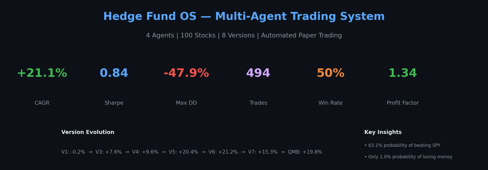
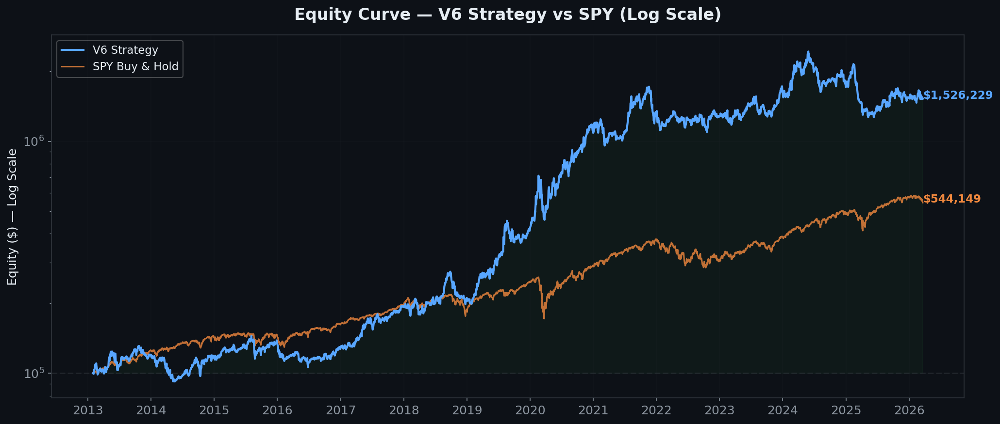
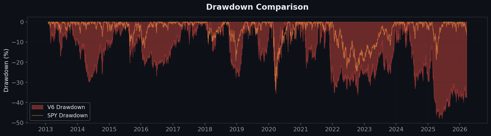
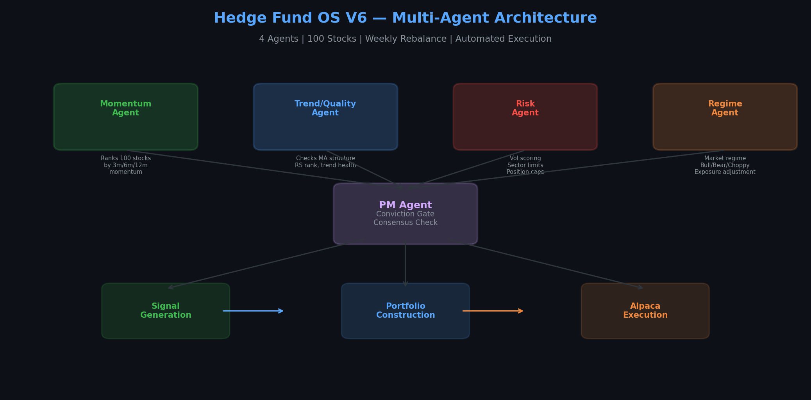
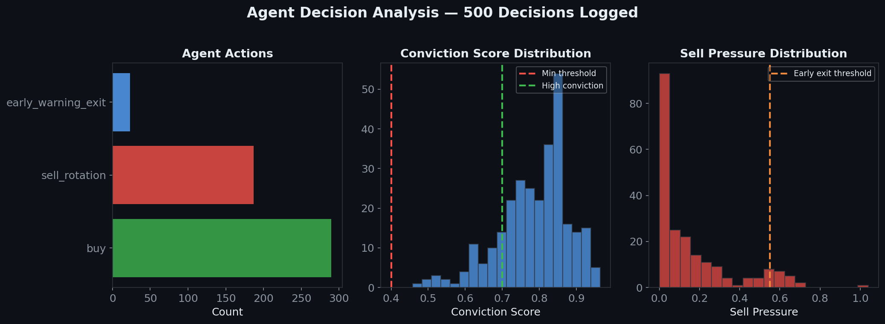
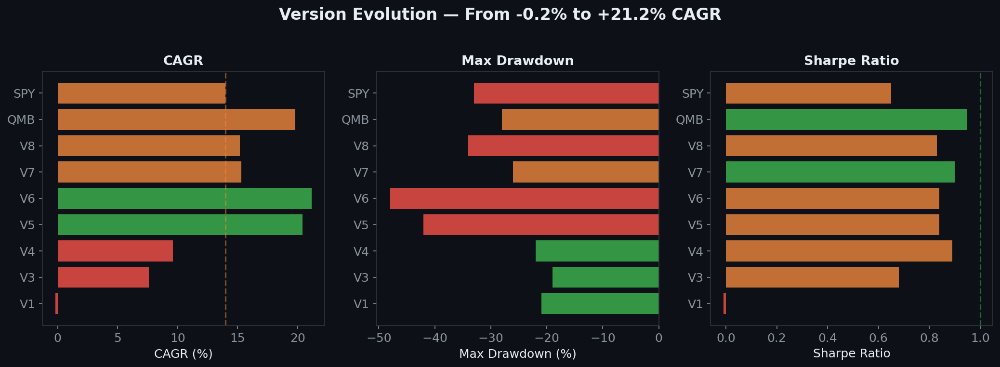
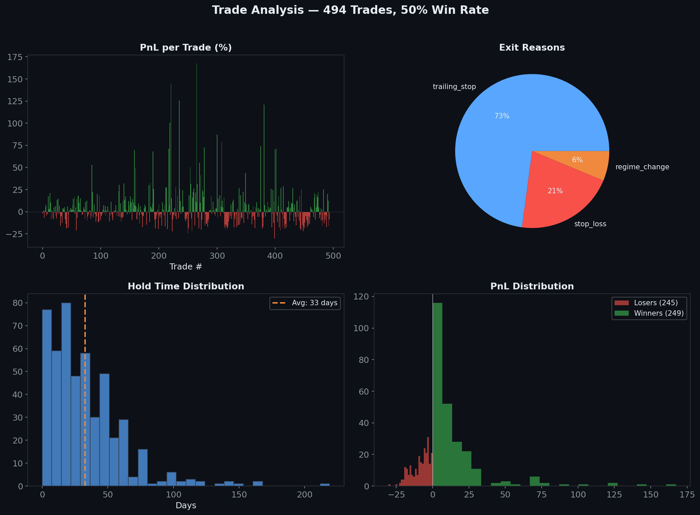
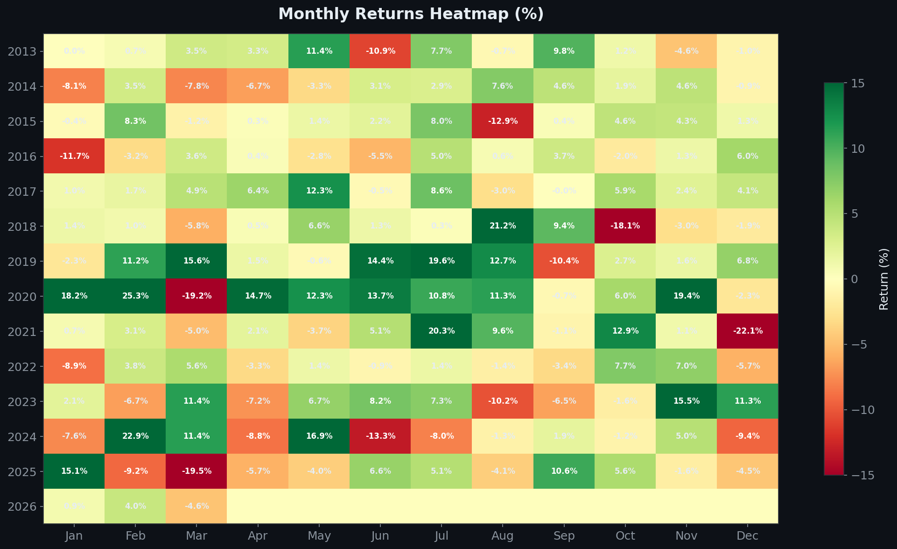
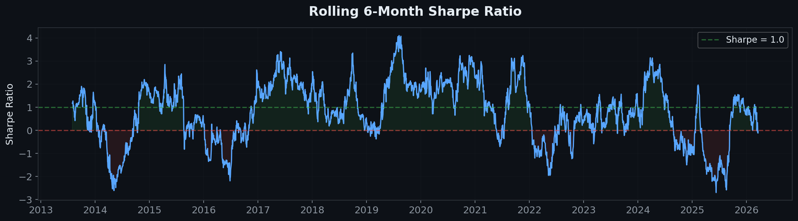
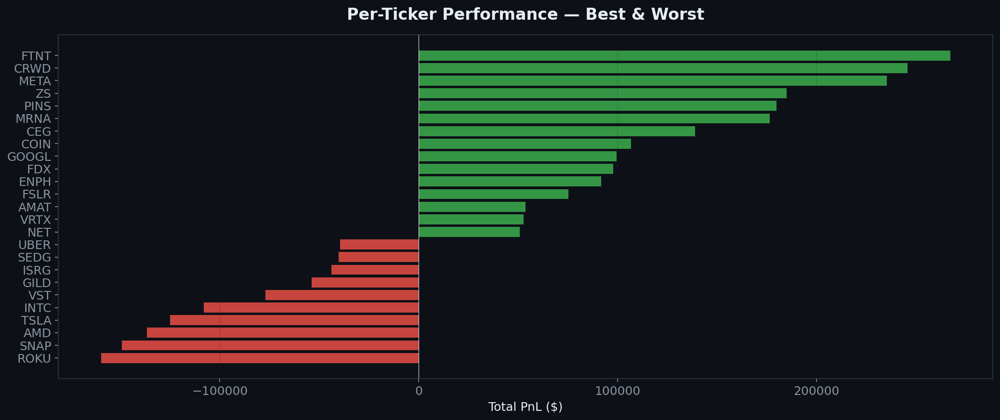

# Multi-Agent Trading System

> **4 specialized agents | 100-stock universe | backtesting and paper-trading workflow**
>
> A role-specialized trading research system where momentum, trend/quality, risk, and regime agents interact through a controlled decision flow. Built as a research prototype to explore institutional-style portfolio construction with full audit trails.



---

## Why This Repo Exists

Most trading repos stop at a single backtest or a single signal. This project explores a more institutional workflow: a role-specialized multi-agent system where momentum, trend/quality, risk, regime, and PM logic interact through a controlled decision flow.

The goal is not to claim alpha. The goal is to build a system where every trade has a structured thesis, every decision is auditable, and the architecture reflects how real systematic funds operate — multiple models, risk controls, and portfolio construction working in sequence.

---

## Current Status

| Component | Status |
|---|---|
| Historical backtesting (8 versions, V1-V8) | Implemented |
| Role-specialized agents (4 + PM) | Implemented |
| Portfolio construction with transaction costs | Implemented |
| Interactive Streamlit dashboard | Implemented |
| Paper trading via Alpaca API | Implemented, live |
| Automated daily execution via GitHub Actions | Implemented |
| Structured decision artifacts | In progress |
| Walk-forward out-of-sample validation | Partial (V7 validated) |
| Agent-level attribution dashboard | Planned |
| Live trading with real capital | Not started |

---

## Production Candidate: QMB Strategy

The Quality Momentum Breakout (QMB) strategy is the current production candidate, selected for its risk-adjusted profile over the raw-CAGR leaders (V5, V6).

| Metric | QMB Strategy | SPY Buy & Hold | Delta |
|---|---|---|---|
| **CAGR** | **+19.8%** | +14.0% | +5.8% |
| **Sharpe Ratio** | **0.95** | ~0.65 | +0.30 |
| **Max Drawdown** | **-28%** | ~-33% | +5% better |
| **Profit Factor** | **1.40** | — | — |
| **Total Trades** | **722** | 0 | — |
| **Avg Hold** | **~30 days** | ∞ | — |
| **Transaction Costs** | **Included** | $0 | 0.05% slippage + $0.005/share |

> Historical backtest result under stated assumptions (2012–2026, 100 US large-cap stocks, weekly rebalance). These are research results, not guaranteed future performance.





---

## Architecture — 4 Specialized Decision Agents

Each trade is evaluated by 4 role-specialized agents. The PM Agent only executes when there is sufficient consensus. Every step produces a typed Signal object with reasoning and confidence score.



| Agent | Role | What It Checks |
|---|---|---|
| **Momentum Agent** | Multi-timeframe momentum scanner | 3m/6m/12m composite ranking across 100 stocks |
| **Trend/Quality Agent** | Trend health validation | MA structure, relative strength, trend direction |
| **Risk Agent** | Position limits and exposure control | Vol-based sizing, sector caps (max 2), correlation penalty |
| **Regime Agent** | Market regime classification | Bull/Bear/Choppy detection, exposure adjustment |
| **PM Agent** | Final decision maker | Conviction gating (>0.4 to trade), consensus check |

### Decision Flow

1. Momentum Agent ranks all qualifying stocks by composite momentum
2. Trend/Quality Agent validates trend health for each candidate
3. Risk Agent enforces position limits, sector caps, and correlation checks
4. Regime Agent assesses market environment and adjusts exposure
5. PM Agent checks conviction threshold → execute or skip
6. Every step logged → **890 agent decisions per full backtest**

---

## Agent Decision Example (Real Output)

This is a real decision from the 2019-01-24 rebalance, not a mockup:

```json
{
  "action": "BUY",
  "ticker": "ZS",
  "agent_scores": {
    "momentum_agent":      {"score": 1.00, "evidence": "rank 1/43, 3m momentum +62%"},
    "trend_quality_agent":  {"score": 0.73, "evidence": "above 150MA, RS rank 67/100"},
    "risk_agent":           {"score": 0.10, "evidence": "vol 46.6% — high but momentum compensates"},
    "regime_agent":         {"score": 0.78, "evidence": "market score 78/100, mild bull"}
  },
  "pm_decision": {
    "conviction": 0.743,
    "threshold": 0.400,
    "result": "APPROVED — high conviction triggers 1.3x position size"
  }
}
```

Full rebalance artifacts are stored in [`reports/decisions/`](reports/decisions/).



---

## Version Evolution — From -0.2% to +19.8% CAGR

The system was iteratively improved across 8 versions. Each version fixed a specific structural problem identified through diagnosis. V6 has the highest raw CAGR but unacceptable drawdown. QMB was selected as the production candidate for its superior risk-adjusted profile.

| Version | Strategy | CAGR | Max DD | Sharpe | Key Fix |
|---|---|---|---|---|---|
| V1 | Breakout only | -0.2% | -21% | -0.01 | Baseline — too many false breakouts |
| V3 | +Pullback, RS filter | +7.6% | -19% | 0.68 | Added pullback entries + relative strength |
| V4 | +Vol targeting, agents | +9.6% | -22% | 0.89 | First agent integration, vol-based sizing |
| V5 | Momentum rotation | +20.4% | -42% | 0.84 | Weekly rotation — first to beat SPY |
| V6 | +Agent team, threshold rebal | +21.2% | -48% | 0.84 | 55% fewer trades, but -48% DD is unacceptable |
| V7 | +Drawdown control, 3-factor | +15.3% | -26% | 0.90 | 46% DD reduction via vol targeting |
| V8 | Regime-adaptive rotation | +15.2% | -34% | 0.83 | Offense/defense switching (rejected: worse risk) |
| **QMB** | **Quality Momentum Breakout** | **+19.8%** | **-28%** | **0.95** | **Best risk-adjusted: inverse-vol weighting** |



---

## Trade Analysis



- **~50% win rate** with asymmetric payoff — winners average +15%, losers average -9%
- **73% of exits via trailing stop** — system lets winners run
- **~30-day average hold** — monthly rotation, not day trading
- Fat right tail: a few large winners (100%+) drive total returns

---

## Monthly Returns



---

## Rolling Risk Metrics



---

## Per-Ticker Performance



---

## Automated Paper Trading

The system runs via **GitHub Actions + Alpaca API**:

- Every weekday at 10:00 AM ET, GitHub Actions triggers the signal pipeline
- Downloads fresh market data, agents score and rank the universe
- Places buy/sell orders on Alpaca paper trading account
- Logs all decisions as downloadable artifacts
- Zero manual intervention required

### Setup

1. Sign up free at [alpaca.markets](https://app.alpaca.markets/signup)
2. Generate Paper Trading API keys
3. Add keys to GitHub: **Settings → Secrets → Actions** (`ALPACA_API_KEY`, `ALPACA_SECRET_KEY`)
4. Workflow runs on schedule or trigger manually from **Actions** tab

---

## Reproducibility

The QMB metrics in this README were generated by:

```bash
# Config: QMB 7-position, inverse-vol weighted
# Universe: DEFAULT_UNIVERSE[:100] (top 100 US large-caps)
# Period: 2012-01-01 to 2026-03-19
# Costs: 0.05% slippage per side + $0.005/share commission
# Rebalance: weekly (every 5 trading days)
# Stops: 15% trailing from peak, 20% hard from entry

python3 run_backtest.py  # generates equity curve, trade log, agent decisions
```

All backtest engines are in `src/backtest/`. Strategy parameters are in each engine's config dataclass.

---

## Quick Start

```bash
pip3 install -r requirements.txt

# Run production backtest
python3 run_backtest.py

# Generate today's signals
python3 generate_signals.py

# Interactive dashboard
python3 -m streamlit run dashboard.py

# Paper trading (requires Alpaca — free)
cp .env.example .env  # add your API keys
python3 paper_trade.py
```

---

## Project Structure

```
├── .github/workflows/         # GitHub Actions (automated daily trading)
├── src/
│   ├── agents/                # 6 agent implementations
│   ├── backtest/              # V1-V8 engines + QMB
│   ├── data/                  # Ingestion + feature engineering
│   ├── decision/              # Orchestrator
│   ├── memory/                # Scoped memory managers
│   └── schemas/               # Structured data models
├── configs/                   # Strategy + risk configuration
├── reports/
│   ├── charts/                # 10 publication-quality visualizations
│   ├── decisions/             # Agent decision artifacts
│   ├── backtests/             # Backtest output data
│   └── paper_trading/         # Paper trading logs
├── run_backtest.py             # Main backtest entry point
├── dashboard.py               # Streamlit dashboard entry point
├── paper_trade.py             # Alpaca paper trading entry point
├── generate_signals.py        # Daily signal generator entry point
├── research/archive/          # V3-V7 historical runners (preserved)
├── tests/                     # Unit tests
└── CHANGELOG.md               # Version history
```

---

## Known Limitations

- **Survivorship bias**: Universe uses today's large-cap names, not point-in-time constituents
- **Period-dependent**: 2012–2026 was a historically strong US equity bull market
- **Max drawdown**: QMB hits -28% in backtest — painful but within research tolerance
- **No shorting**: Long-only limits Sharpe to ~1.0 without leverage
- **Free data only**: yfinance has limitations vs institutional data feeds
- **No intraday monitoring**: System runs once daily, does not track positions intraday
- **Paper trading evidence is limited**: System has been live for days, not months
- **Backtests are historical simulations**: Results depend on universe, rebalance assumptions, and cost model

---

## Roadmap

- [x] V1-V8 strategy evolution
- [x] Role-specialized agent system
- [x] Interactive Streamlit dashboard
- [x] Alpaca paper trading
- [x] GitHub Actions automation
- [ ] 90-day paper trading validation
- [ ] Walk-forward out-of-sample testing
- [ ] Agent-level performance attribution
- [ ] Live trading with small capital
- [ ] Alternative data integration

---

## License

```
Apache License Version 2.0, January 2004
Copyright 2026 Sathwik Rao Nadipelli
```

This repository contains a research and infrastructure framework only. The authors make no claims regarding financial performance. Example results shown are for research and educational purposes only. This software is not intended to be used as financial advice or as a production trading system without independent validation.
